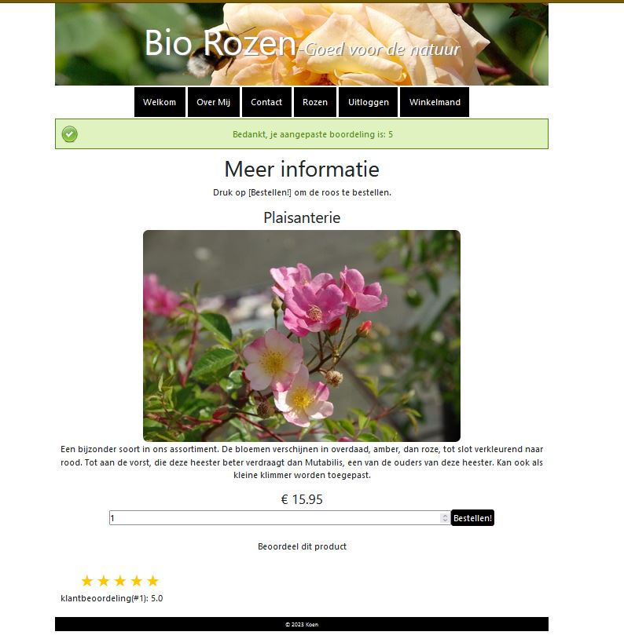
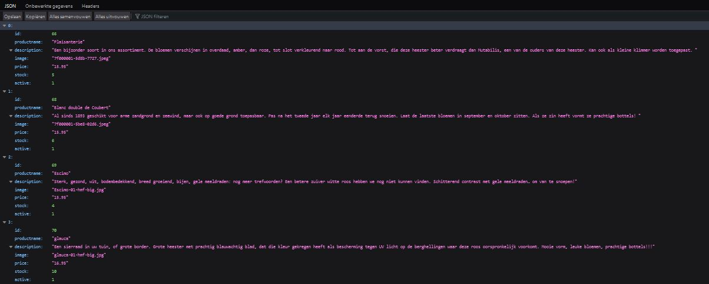

# PHP Webshop (Object Oriented Programming)
A webshop for rose bushes using various techniques, like asynchronous programming for updating the shopping cart and rating products. 

----
### Technologies
* PHP (backend)
* JavaScript (frontend)
* HTML
* CSS
* MySQL
* AJAX
----
### Design Patterns: 
* OOP, 
* MVC, 
* Dependency Injection, 
* Singleton
----
### Rating products via Ajax call

----
### Access product cataloque via API call

